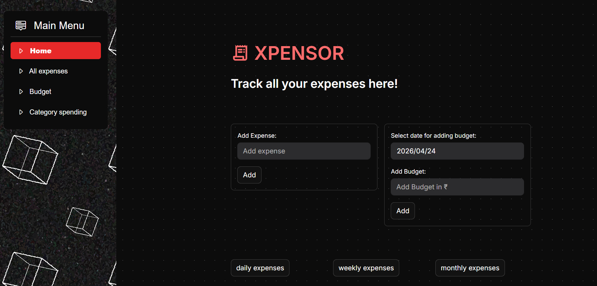
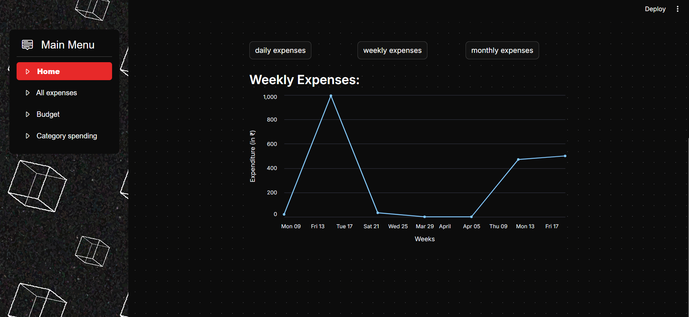
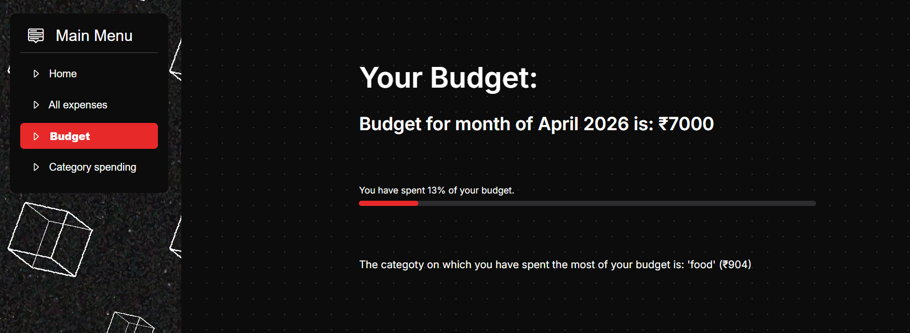
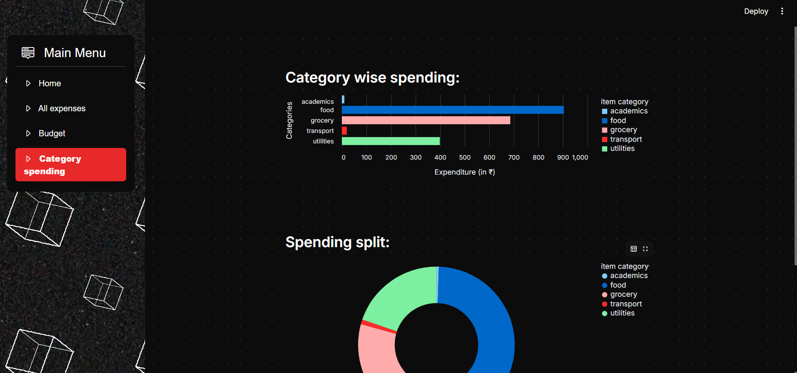
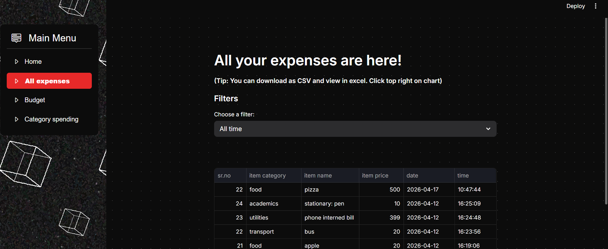

# XPENSOR

A lightweight web-based expense tracker built with **Python** and **Streamlit**.

XPENSOR helps you keep track of your expenses, organize them into categories, set a monthly budget, and visualize your spending through interactive charts.

The project currently uses **CSV files** as its storage backend to keep the application simple and easy to run. A future update will migrate the data layer to **SQLite (or another SQL database)** for improved scalability and reliability.

---

## Screenshots

### Home


### Expense Dashboard


### Budget Overview


### Category Analytics


### Expense History


---

## Features

- Add expenses with category, item name, and price
- Monthly budget management
- Daily, weekly, and monthly spending visualizations
- Category-wise spending analysis
- Spending distribution using a donut chart
- Expense history table
- CSV export support through Streamlit
- Dark-themed user interface

---

## Tech Stack

| Technology | Purpose |
|------------|---------|
| Python | Backend logic |
| Streamlit | Web application |
| Pandas | Data processing |
| Altair | Data visualization |
| CSV | Data storage (current) |
| Regex | Input validation |

---

## Project Structure

```text
XPENSOR/
│
├── app.py                 # Streamlit application
├── main.py                # logic
├── data/
│   ├── expenses.csv
│   ├── budget.csv
│   └── background.jpg
│
├── images/
│   └── screenshots...
│
├── requirements.txt
└── README.md
```

---

## Installation

Clone the repository

```bash
git clone https://github.com/yourusername/xpensor.git
```

Move into the project directory

```bash
cd xpensor
```

Install dependencies

```bash
pip install -r requirements.txt
```

Run the application

```bash
streamlit run app.py
```

---

## Usage

### Adding an Expense

Expenses should be entered in the following format:

```text
category, item name, price
```

Example:

```text
food, pizza, 500
```

The category is optional.

```text
pizza, 500
```

If omitted, the expense is automatically assigned to the **Other** category.

---

## Available Categories

- Food
- Utilities
- Academics
- Transport
- Personal
- Health
- Entertainment
- Subscriptions
- Miscellaneous

---

## Budget Tracking

XPENSOR allows one budget entry per month.

If a budget already exists for a month, adding another value updates the existing budget instead of creating a duplicate entry.

The Budget page displays:

- Current monthly budget
- Budget utilization percentage
- Progress bar
- Highest spending category

---

## Analytics

XPENSOR includes several visualizations to better understand spending patterns.

- Daily expense trend
- Weekly expense trend
- Monthly expense trend
- Category-wise expenditure
- Spending distribution (donut chart)

---

## Current Limitations

- Uses CSV files instead of a database
- Limited filtering options
- Single-user application
- No authentication
- No recurring expense support

---

## Roadmap

Planned improvements include:

- [ ] SQLite database
- [ ] API integration for AI insights
- [ ] User authentication
- [ ] Multi-user support
- [ ] Advanced filtering
- [ ] Search functionality
- [ ] Budget alerts
- [ ] Expense editing and deletion
- [ ] Recurring expenses
- [ ] REST API

---

## What I Learned

Building XPENSOR helped me gain practical experience with:

- Streamlit application development
- Data visualization using Altair
- Data processing with Pandas
- CSV-based persistence
- Input validation using regular expressions
- Organizing application logic into reusable modules

---

## Contributing

Contributions, suggestions, and bug reports are welcome.

Feel free to open an issue or submit a pull request.

---

## License

This project is licensed under the MIT License.
